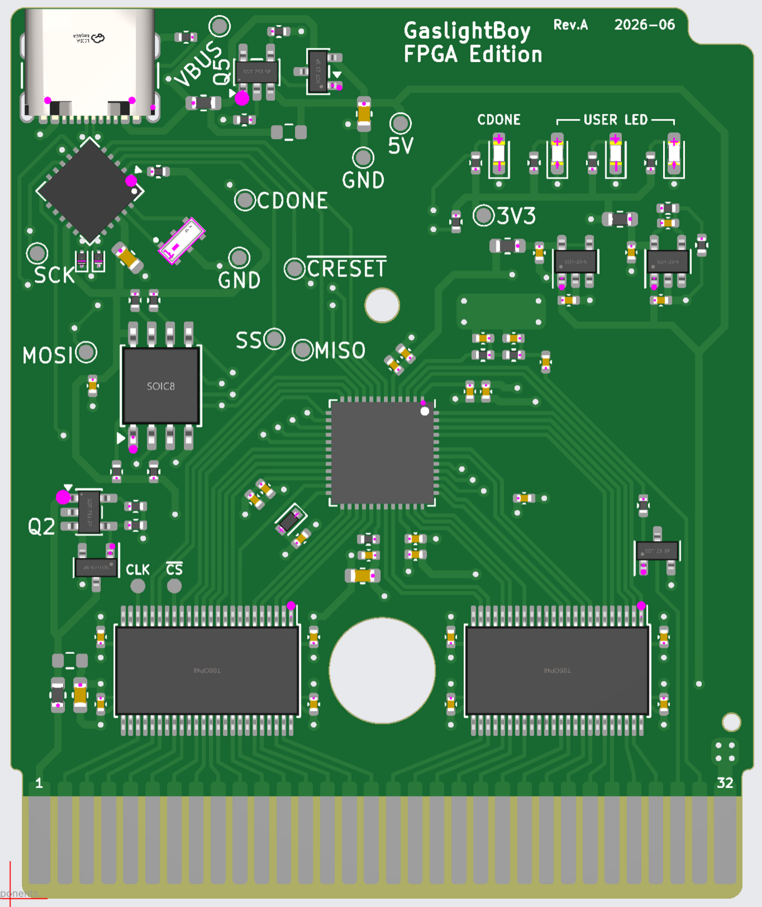

# FPGBC - Field Programmable Game Boy Cartridge
This is a project for an open-source cartridge for the Game Boy (Color).
Each cartridge contains an iCE40UP5K FPGA, interfacing through level shifters with the Game Boy and through an MCP2210 with your PC.

## Licensing
The hardware is licensed under the [BSD 3-clause license](./hardware/LICENSE),
being a modified version of [tsuraraGB](https://github.com/rniwase/tsuraraGB/).

All non-hardware code (including FPGA code, python tooling, etc.) is licensed under the [GPLv3](./LICENSE)
